<h1 align="center">
    
</h1>

# Curso front-end CodeBlue

    <a href="https://codeblue-frontend-ten.vercel.app/">codeblue-frontend-ten.vercel.app</a>

<h2 align="center">Projeto Final E-commerce (em desenvolvimento)</h2>

    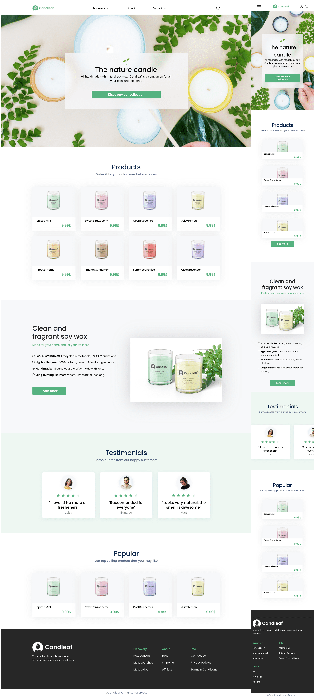

### Desenvolvicom com:

- HTML
- CSS
- Javascript/Jquery

[Veja projeto final - Ecormmerce online](https://codeblue-frontend-ten.vercel.app/projetos/projetofinal-ecommerce/index.html)

## Projetos

<table>
    <tr>
        <td>
            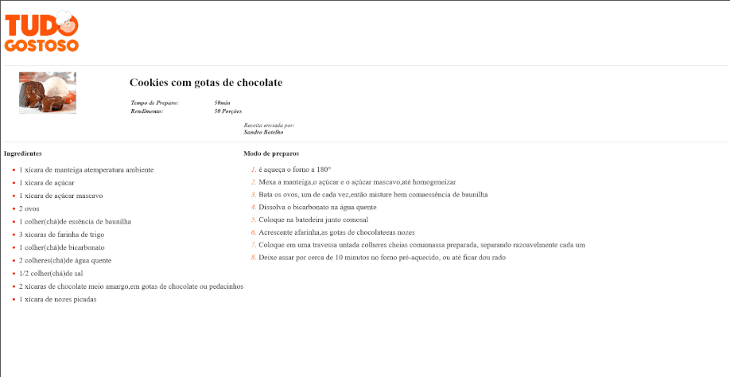
            <a href="https://codeblue-frontend-ten.vercel.app/projetos/cardapio/index.html"><strong>Tudo Gostoso</strong></a>
        </td>
        <td>
            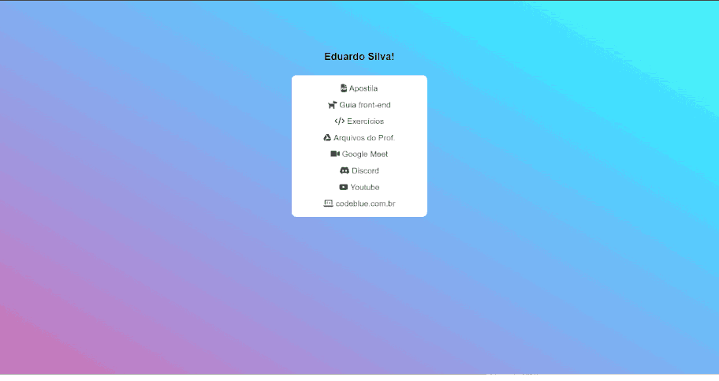
            <a href="https://codeblue-frontend-ten.vercel.app/projetos/links/index.html"><strong>Links CodeBlue</strong></a>
        </td>
        <td>
            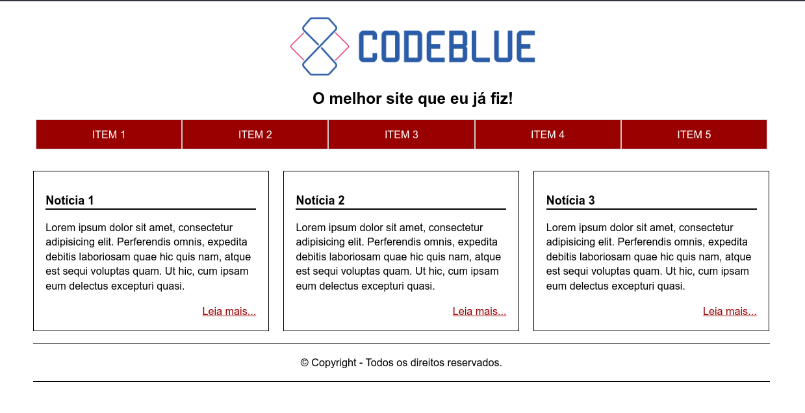
            <a href="https://codeblue-frontend-ten.vercel.app/projetos/noticias/index.html"><strong>Notícias</strong></a>
        </td>
    </tr>
    <tr>
        <td>
            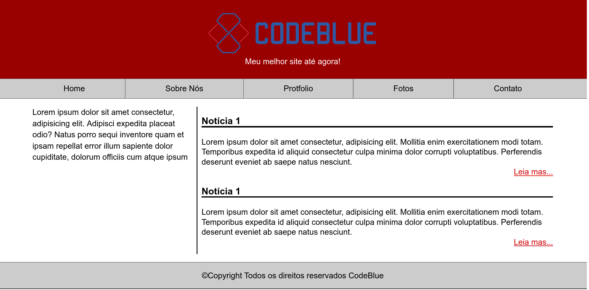
            <a href="https://codeblue-frontend-ten.vercel.app/projetos/noticias-v2/index.html"><strong>Notícias V2</strong></a>
        </td>
        <td>
            <a href="https://codeblue-frontend-ten.vercel.app/projetos/foto-criativa/index.html"><strong>Foto Criativa</strong></a>
            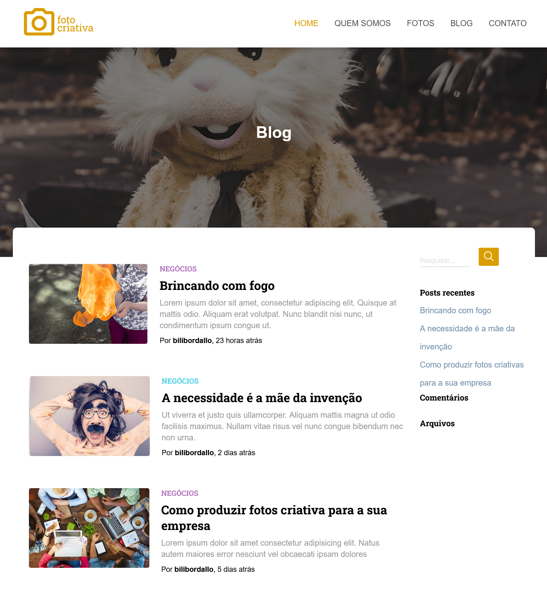
        </td>
        <td>
            <a href="https://codeblue-frontend-ten.vercel.app/projetos/exercicio03/index.html"><strong>Site Responsivo</strong></a>
            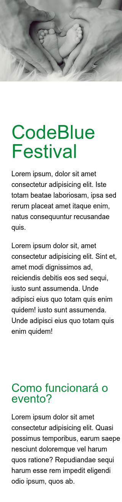
        </td>
    </tr>
    <tr>
        <td>
            
            <a href="https://codeblue-frontend-ten.vercel.app/projetos/site-com-ecommerce/index.html"><strong>Site com Ecormmerce</strong></a>
        </td>
        <td>
            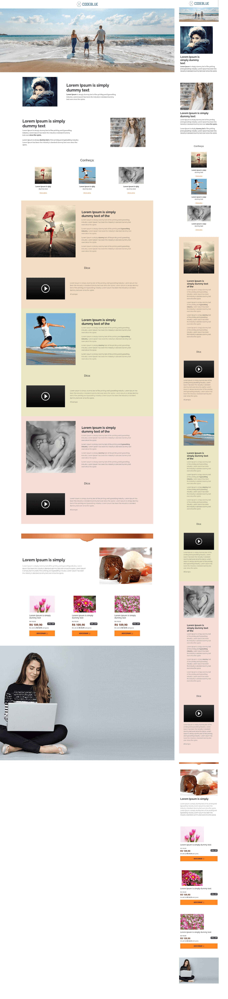
            <a href="https://codeblue-frontend-ten.vercel.app/projetos/site-com-ecommerce-bootstrap/index.html"><strong>Site com Bootstrap</a>
        </td>
    </tr>
    <tr>
        <td>
            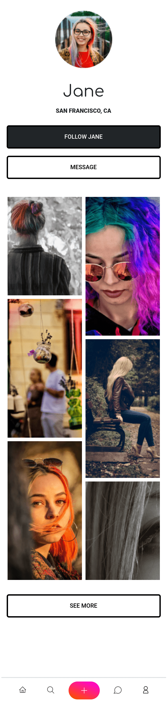
            <a href="https://codeblue-frontend-ten.vercel.app/projetos/tela-inicial-rede-social/index.html"><strong>Tela inicial Rede Social</strong></a>
        </td>
        <td>
            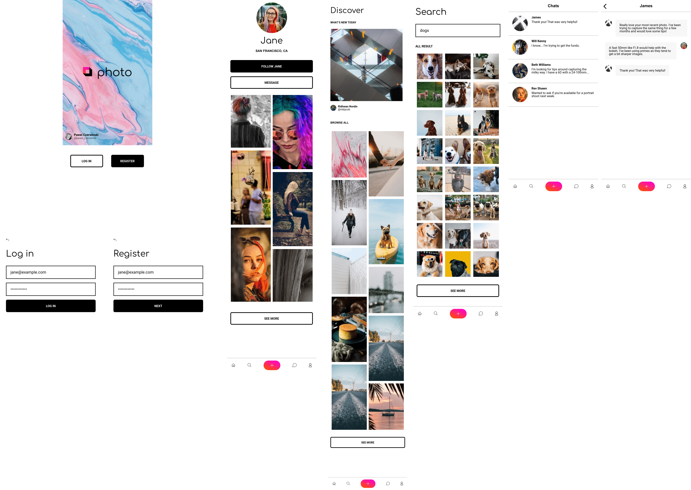
            <a href="https://codeblue-frontend-ten.vercel.app/projetos/rede-social-photo/index.html"><strong>Rede Social Photo</strong></a>
        </td>
        <td>
            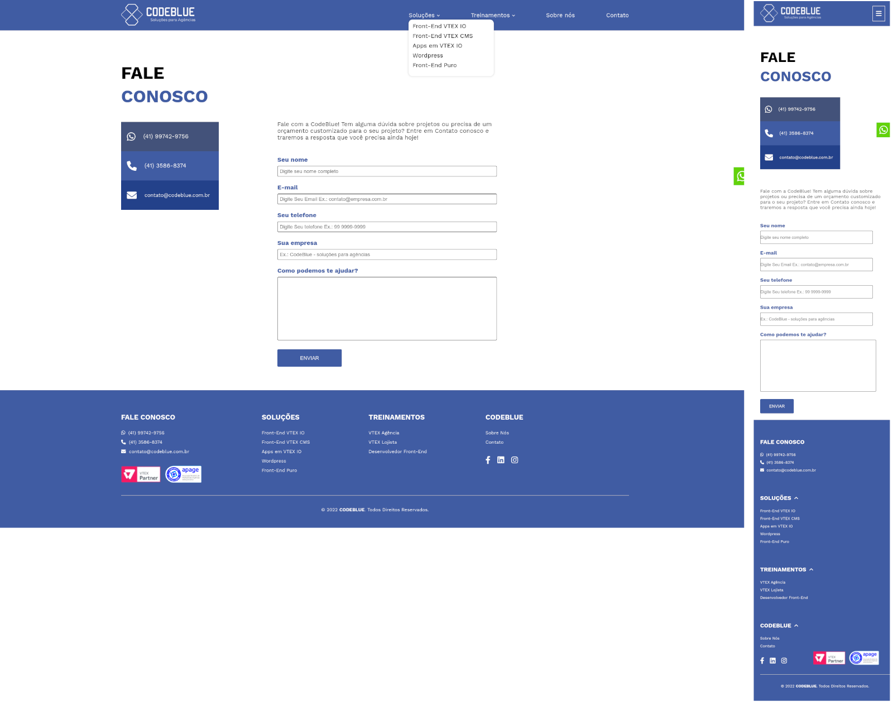
            <a href="https://codeblue-frontend-ten.vercel.app/projetos/codeblue-contato/index.html"><strong>CodeBlue - Contato</strong></a>
        </td>
    </tr>
    <tr>
        <td>
            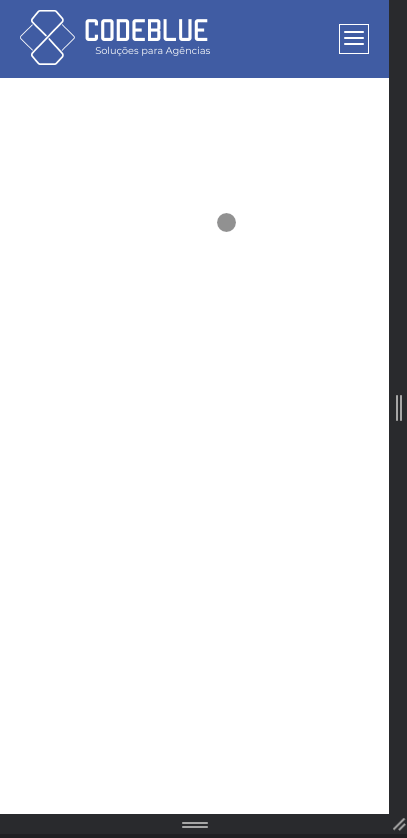
            <a href="https://codeblue-frontend-ten.vercel.app/projetos/menu-mobile/index.html"><strong>Menu mobile</strong></a>
        </td>
    </tr>
</table>

